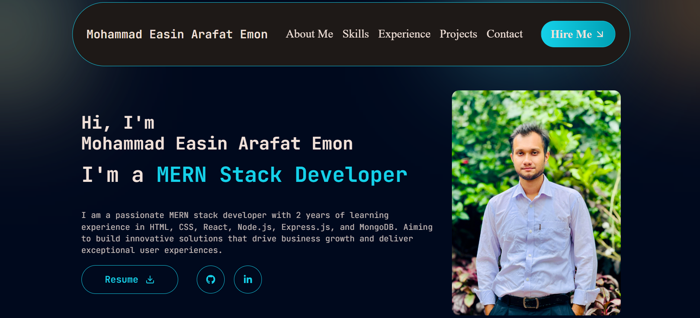

# 🚀 MERN Stack Developer Portfolio



> ✨ A vibrant showcase of my skills, projects, and professional journey as a full-stack developer ✨

---

## 🚀 Live Deployment  
<div align="left">

[](https://my-portfolio-rouge-eight-67.vercel.app/)  
[](https://github.com/EmonHossen10/my-portfolio)

</div>

---

## 🎨 Tech Stack

### 🖥️ Frontend
| Technology | Purpose | Badge |
|------------|---------|-------|
| **React.js** | Core Framework |  |
| **Tailwind CSS** | Utility-first Styling |  |
| **Framer Motion** | Smooth Animations |  |
| **React Icons** | Beautiful Icons |  |

### ⚙️ Backend
| Technology | Purpose | Badge |
|------------|---------|-------|
| **Node.js** | Runtime Environment |  |

---

## ✨ Key Features

<div align="left">

🎨 **Stunning Design**  
- Vibrant color scheme  
- Modern UI/UX principles  
- Fully responsive layout  

⚡ **High Performance**  
- 90+ Lighthouse score  
- Optimized assets  
- Fast page loads  

📩 **Contact System**  
- Working contact form  
- Email notifications  
- Spam protection  

🔍 **SEO Optimized**  
- Proper meta tags  
- Semantic HTML  
- Fast rendering  

</div>

---

## 🛠️ Installation Guide

### Prerequisites
- Node.js v18+
- npm v9+

### Setup Instructions
```bash
# Clone with colorful output
echo -e 
git clone https://github.com/EmonHossen10/my-portfolio.git

cd portfolio

echo -e 
npm install

echo -e 
npm run dev
