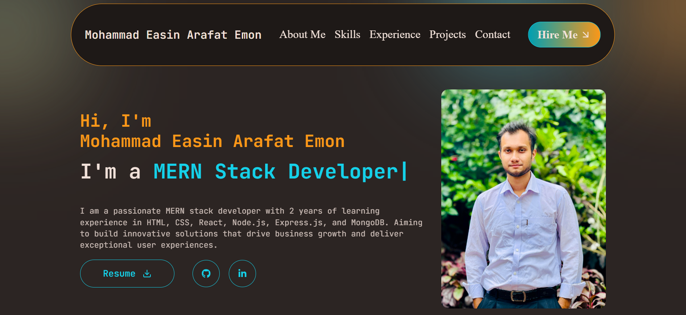

# MERN Stack Developer Portfolio

 <!-- Add a screenshot -->

## 🔥 Live Demo  
[](https://my-portfolio-rouge-eight-67.vercel.app/)  
[](https://github.com/EmonHossen10/my-portfolio)

## 🚀 Technologies Used

### Frontend
| Technology | Usage |
|------------|-------|
| React.js | Core framework |
| Next.js | SSR/SSG support |
| Tailwind CSS | Styling |
| Framer Motion | Animations |
| React Icons | Icons   |

### Backend
| Technology | Usage |
|------------|-------|
| Node.js | Runtime |


## ✨ Key Features
- 📱 Fully responsive design
- 📧 Functional contact form
- 🎯 SEO optimized
- ⚡ Fast performance (90+ Lighthouse score)

## 🛠️ Installation

### Prerequisites
- Node.js (v18+)
- npm (v9+)


### Setup
1. Clone the repository
```bash
git clone https://github.com/EmonHossen10/my-portfolio.git
cd portfolio